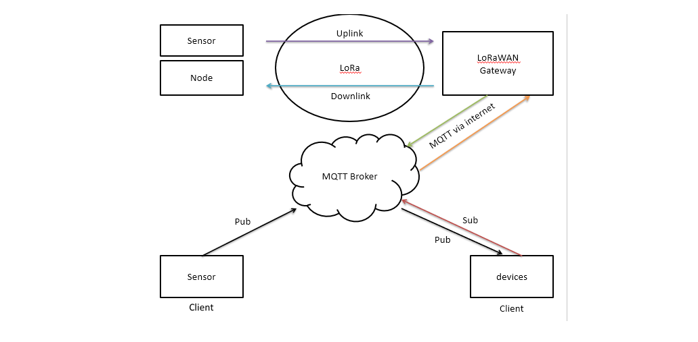
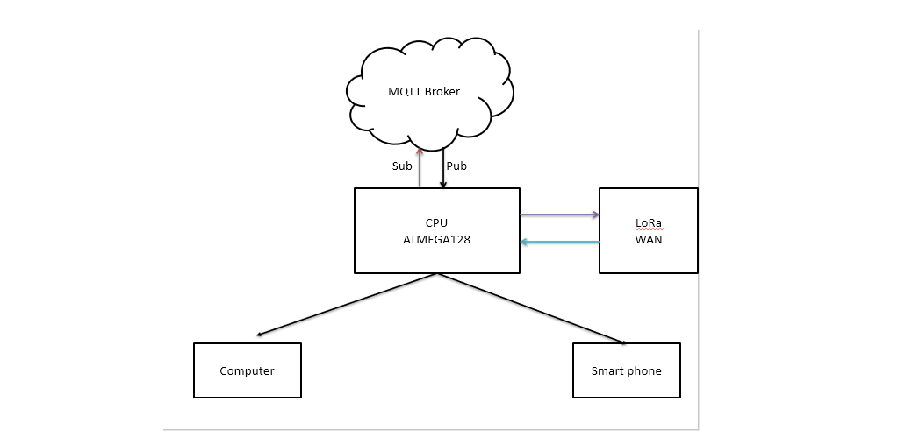

# ESLAB-Project-GaAs
Garden assistant is the kind of The smart garden is an innovative self-growing garden for every home and every plant growing need. Experience the benefits of having your own garden, no matter where you live. All of things will be display in smartphone, pc (personal computer) and display devices. With access your system, you'll get: You can keep track of the items in your garden and search for information on your plants.
+ Automatic watering.
+ Perfect amount of light thanks to UV-A lights.
+ Perfect amount of nutrients and oxygen at root level.
+ follow temperature, humidity and PH your garden. 
The system include atmega128 microcontroller with role be CPU (A central processing unit). peripheral devices of system are esp8266, SX1278 LoRa Module, module sim800L, rtc (real time clock) ds3231 moduleLCD, keyboard matrix and sensors.

